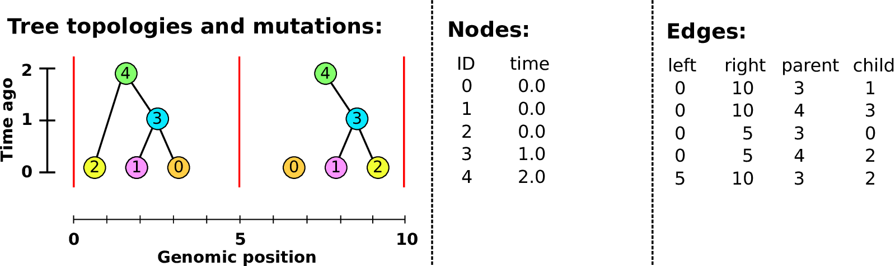
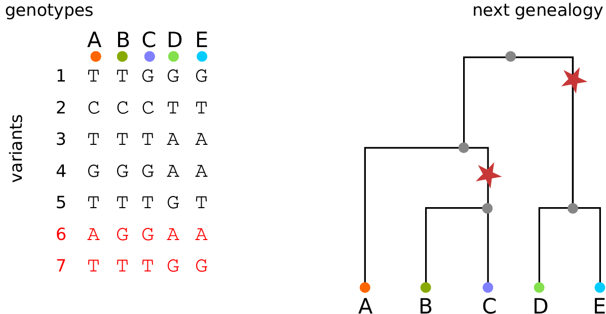

# Genomes, and applications

<!-- Abstract: 40 minutes plus questions
Thanks to rapid technological advances in genome sequencing, today's large
genomic datasets commonly describe genetic variation in tens or hundreds of
thousands of individuals across hundreds of thousands of nucleotide positions.
However, extracting information about human health and history from these
datasets is challenging, both because the connection between the biological
processes and genomic patterns is extremely noisy, and because of the sheer
size of the datasets. In this talk, I will describe how thinking about the
process that produced the data - the sequence of genealogical trees that
describe inheritance as we move along the genome, known as the "tree sequence"
- has led to orders-of-magnitude increases in our ability to store and work
with genomic data.
//-->

## Genomes

::: {.columns}
::::::: {.column width=50%}

> - are very big ($10^7$--$10^{12}$ nucleotides)
> - encode the basic *mechanisms* of life
> - reflect past *history* and *process*

:::
::::::: {.column width=50%}

:::
:::::::

## Genomes

::: {.columns}
::::::: {.column width=30%}

*For example, in humans (low diversity):*

- out of $3 \times 10^8$ nucleotides,
- individuals differ at around 5 million sites
- 88 million varying sites in 2500 genomes
     <!-- 1000G: https://www.nature.com/articles/nature15393 -->

:::
::::::: {.column width=70%}

::: {.centered}

:::

:::
:::::::

## Genome-wide association studies

*What genetic variants affect disease incidence/severity?*

. . .

*How?*

1. Fit a model of `severity ~ genotype` separately at each site, and
2. look at sites with significant $p$-value.

--------

::: {.centered}

::: {.caption}
[from SbotGwa](https://twitter.com/SbotGwa)
:::
:::

--------

::: {.centered}

:::

<!--

## Genomic-assisted selection

1. Fit a model of `yield ~ genotype` separately at each site, and
2. add up effect across all sites to get a *polygenic score*, or *breeding value*,
3. use high-scorers as parents of next generation.

-->

## History from genomes

::: {.columns}
::::::: {.column width=50%}

::: {.centered}

::: {.caption}
[Lalueza-Fox & Gilbert](https://www.sciencedirect.com/science/article/pii/S096098221101270X])
:::
:::

:::
::::::: {.column width=50%}

::: {.centered}
{width=80%}

::: {.caption}
[flickr:timevanson](https://commons.wikimedia.org/w/index.php?curid=20187477)
:::
:::

:::
:::::::

## Common tasks:

1. *Storing* genomes ($10^7$ sequences of $10^7$ nucleotides)
2. *Computing* similarity, correlation
3. *Simulating* these data from evolutionary scenarios
4. *Reconstructing* genealogies

## 

A data structure is...

. . .

**succinct** if it
only stores each bit of information once.

. . .

**descriptive** if it
reflects the underlying process.

. . .

**So:** let's think about the process that generated the data!

# Genomes and genealogies

## Meiosis & Recombination

::: {.centered}
You have two copies of each chromosome, 
  one from each parent.
:::

. . .

::: {.centered}
When you make a gamete, the copies *recombine*,

and copying errors lead to *mutations*.
:::

## 

Your two copies of the genome
were inherited, noisily, from your two parents,

. . .

and from your four grandparents,

. . .

and your eight great-grandparents

. . .

and your sixteen great-great-grandparents

. . .

**but:** you have not inherited *any* genome from *most* of your ancestors,
past about 10 generations ago.

## 

::: {.centered}
{width=60%}

::: {.caption}
from [gcbias.org](https://gcbias.org/2013/11/11/how-does-your-number-of-genetic-ancestors-grow-back-over-time/)
:::
:::

## 

::: {.centered}
{width=60%}

::: {.caption}
from [gcbias.org](https://gcbias.org/2013/11/11/how-does-your-number-of-genetic-ancestors-grow-back-over-time/)
:::
:::

##

::: {.columns .vcentered}
::::::: {.column width=50%}

In fact, the number of $k^\text{th}$ *genetic* ancestors
grows *linearly* with $k$.

:::
::::::: {.column width=50%}
::: {.centered}

::: {.caption}
from [gcbias.org](https://gcbias.org/2013/11/11/how-does-your-number-of-genetic-ancestors-grow-back-over-time/)
:::
:::

:::
:::::::

# Looking backwards

##

::: {.columns}
::::::: {.column width=50%}

Tracing back the 
ancestry of some chromosomes:

- blocks labeled by who inherits from them
-  blocks can *split* 
-  or *coalesce*, 
-  and *mutations* lead to differences. 

Result: a *labeled genealogy* containing all the *genealogical trees*.

:::
::::::: {.column width=50%}

:::: {.floatright}
{width=80%}
::::

:::
::::::: 

##

::: {.columns}
::::::: {.column width=50%}

Tracing back the 
ancestry of some chromosomes:

- blocks labeled by who inherits from them
- blocks can *split*
-  or *coalesce*, 
-  and *mutations* lead to differences. 

Result: a *labeled genealogy* containing all the *genealogical trees*.

:::
::::::: {.column width=50%}

:::: {.floatright}
{width=80%}
::::

:::
::::::: 

##

::: {.columns}
::::::: {.column width=50%}

Tracing back the 
ancestry of some chromosomes:

- blocks labeled by who inherits from them
- blocks can *split*
- or *coalesce*,
-  and *mutations* lead to differences. 

Result: a *labeled genealogy* containing all the *genealogical trees*.

:::
::::::: {.column width=50%}

:::: {.floatright}
{width=80%}
::::

:::
::::::: 

##

::: {.columns}
::::::: {.column width=50%}

Tracing back the 
ancestry of some chromosomes:

- blocks labeled by who inherits from them
- blocks can *split*
- or *coalesce*,
-  and *mutations* lead to differences. 

Result: a *labeled genealogy* containing all the *genealogical trees*.

:::
::::::: {.column width=50%}

:::: {.floatright}
{width=80%}
::::

:::
::::::: 

##

::: {.columns}
::::::: {.column width=50%}

Tracing back the 
ancestry of some chromosomes:

- blocks labeled by who inherits from them
- blocks can *split*
- or *coalesce*,
-  and *mutations* lead to differences. 

Result: a *labeled genealogy* containing all the *genealogical trees*.

:::
::::::: {.column width=50%}

:::: {.floatright}
{width=80%}
::::

:::
::::::: 

##

::: {.columns}
::::::: {.column width=50%}

Tracing back the 
ancestry of some chromosomes:

- blocks labeled by who inherits from them
- blocks can *split*
- or *coalesce*,
-  and *mutations* lead to differences. 

Result: a *labeled genealogy* containing all the *genealogical trees*.

:::
::::::: {.column width=50%}

:::: {.floatright}
{width=80%}
::::

:::
::::::: 

##

::: {.columns}
::::::: {.column width=50%}

Tracing back the 
ancestry of some chromosomes:

- blocks labeled by who inherits from them
- blocks can *split*
- or *coalesce*,
- and *mutations* lead to differences.

Result: a *labeled genealogy* containing all the *genealogical trees*.

:::
::::::: {.column width=50%}

:::: {.floatright}
{width=80%}
::::

:::
::::::: 

##

::: {.columns}
::::::: {.column width=50%}

Tracing back the 
ancestry of some chromosomes:

- blocks labeled by who inherits from them
- blocks can *split*
- or *coalesce*,
- and *mutations* lead to differences.

Result: a *labeled genealogy* containing all the *genealogical trees*.

:::
::::::: {.column width=50%}

:::: {.floatright}
{width=80%}
::::

:::
::::::: 

<!-- explain tree sequences and why they are so efficient (5min) -->
# The tree sequence

## History is a sequence of trees

For a set of sampled chromosomes,
at each position along the genome there is a genealogical tree
that says how they are related.

. . .

{width=100%}

----------------------

The **succinct tree sequence**

::: {.floatright}
is a way to succinctly describe this, er, sequence of trees

*and* the resulting genome sequences.
:::

. . .

::: {.floatright}
{width=50%}

:::: {.caption}
by Jerome Kelleher,
in [Kelleher, Etheridge, and McVean](http://journals.plos.org/ploscompbiol/article?id=10.1371/journal.pcbi.1004842) 
::::
:::

## Example: three samples; two trees; two variant sites

## Nodes and edges

Edges 

:   Who inherits from who.

    Records: interval (left, right); parent node; child node.

Nodes 

:   The ancestors those happen in.

    Records: time ago (of birth); ID (implicit).

-------------------

-------------------

-------------------

-------------------

-------------------

-------------------

-------------------

## Sites and mutations

Mutations

:   When state changes along the tree.

    Records: site it occured at; node it occurred in; derived state.

Sites 

:   Where mutations fall on the genome.

    Records: genomic position; ancestral (root) state; ID (implicit).

------------------

------------------

------------------

------------------

------------------

------------------

**The result:**
an encoding of the genomes *and* all the genealogical trees.

::: {.centered}

:::

# How's it work?

## File sizes

::: {.centered}
{width=90%}
:::

::: {.caption}
100Mb chromosomes;
from [Kelleher et al 2018, *Inferring whole-genome histories in large population datasets*](https://www.nature.com/articles/s41588-019-0483-y), Nature Genetics
:::

<!-- Estimated sizes of files required to store the genetic variation data for a
simulated human-like chromosome (100 megabases) for up to 10 billion haploid
(5 billion diploid) samples. Simulations were run for 10 1 up to 10 7 haplotypes
using msprime [Kelleher et al., 2016], and the sizes of the resulting files plotted
(points). -->

---------------

---------------

---------------

## For $N$ samples genotyped at $M$ sites

::: {.columns}
::::::: {.column width=50%}

*Genotype matrix*:

$N \times M$ things.

:::
::::::: {.column width=50%}

*Tree sequence:*

- $2N-2$ edges for the first tree
- $\sim 4$ edges per each of $T$ trees
- $M$ mutations

$O(N + T + M)$ things

:::
:::::::

{width=70%}

## Fast genotype statistics

::: {.centered}
{width=70%}
:::

::: {.caption}
from [R., Thornton and Kelleher 2019, *Efficiently summarizing relationships in large samples*](https://www.biorxiv.org/content/10.1101/779132v1?rss=1), bioRxiv
:::

# Demonstration

----------

[jupyter demonstration](https://github.com/petrelharp/reed_aug_2020)

# Wrap up

## Code availability

::: {.columns}
::::::: {.column}

Everything is efficient, open, and tested:

- `tskit`: tree sequence tools 

    [github:tskit-dev/tskit](https://github.com/tskit-dev/tskit)

- `msprime`: coalescent simulator,

    [github:tskit-dev/msprime](https://github.com/tskit-dev/msprime)

- `SLiM` : forwards evolutionary simulator

    [messerlab.org/slim](https://messerlab.org/slim/)

:::
::::::: {.column}

{width=100%}

:::
:::::::

## Thanks

::: {.columns}
:::::::: {.column}

- Philipp Messer
- Boyana Norris
- Gil McVean
- Georgia Tsambos
- Yan Wong
- Simon Myers
- Wilder Wohns
- Kevin Thornton
- Graham Coop
- Gideon Bradburd
- Alison Etheridge
- CJ Battey
- Andy Kern

:::
:::::::: {.column}

- `tskit-dev`
- Jerome Kelleher
- Ben Haller
- Jared Galloway
- Jaime Ashander

Funding: NSF, UO (PR); Wellcome Trust (JK);

Slides with [reveal.js](http://hakim.se) and [pandoc](https://pandoc.org/).

{width=50%}

:::
::::::::

<!-- questions?? -->
## {data-background-image="figs/guillemots_thanks.png" data-background-position=center data-background-size=50%}

